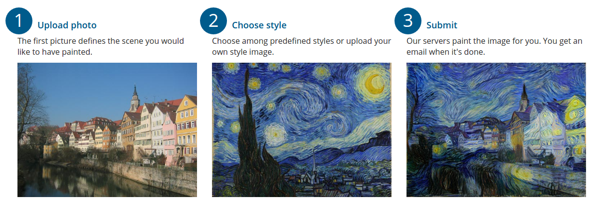
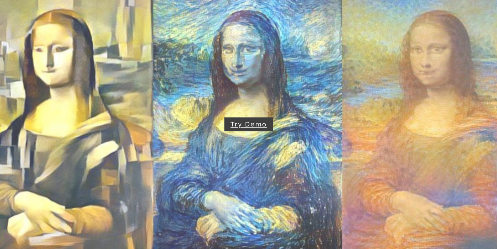
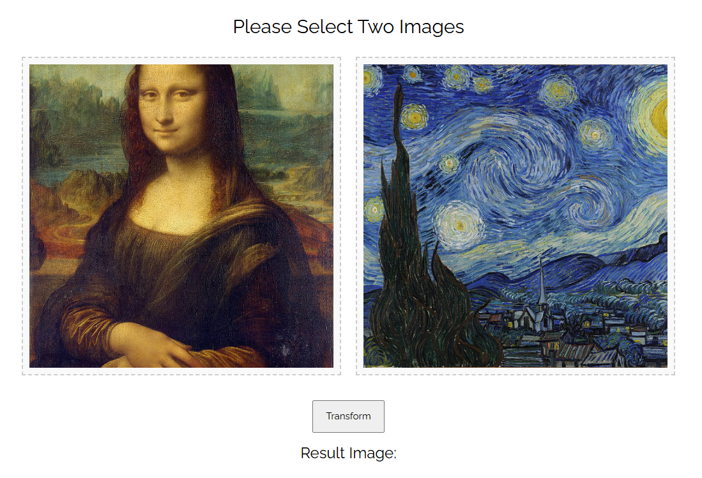
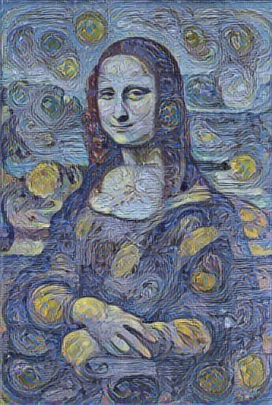

# Neural Style Transfer

This project implements Neural Style Transfer (NST) to apply the artistic style of one image onto the content of another using deep learning techniques. The model utilizes pre-trained convolutional neural networks (CNNs) to extract content and style representations.



## Features
- Artistic style transfer for any image
- Web-based interface for easy image upload
- Deployed on Vercel for live usage

## Installation
Clone the repository and install dependencies:
```bash
git clone https://github.com/annepham1512/neural-style-transfer.git
pip install -r requirements.txt
```

##  Neural Style Transfer Web UI Guide

Follow these steps to use the Neural Style Transfer web interface:

### Step 1: Launch the App
- Run the app:
   ```bash
   python app.py
   ```
- Open a browser and go to http://localhost:5000
- Click on **Try Demo** button

<br>



### Step 2: Upload Images
- **Content Image**: Upload the image you want to preserve the structure of.
- **Style Image**: Upload the image whose style you want to apply.

<br>


- I have selected two images for the neural style transfer process:

    - Content Image: The Mona Lisa, painted by Leonardo da Vinci during the Italian Renaissance.
    - Style Image: The Starry Night, painted by Vincent van Gogh.



### Step 3: Run Transfer
- My goal is to see how the Mona Lisa would appear if painted in the distinctive style of The Starry Night. Let’s proceed to view the results of this artistic transformation.

- Click **Transfer** to start the process.

<p align="center">
  
</p>


## License

- This project is licensed under the MIT License.
- Feel free to modify this template based on further specific details from the repo!
